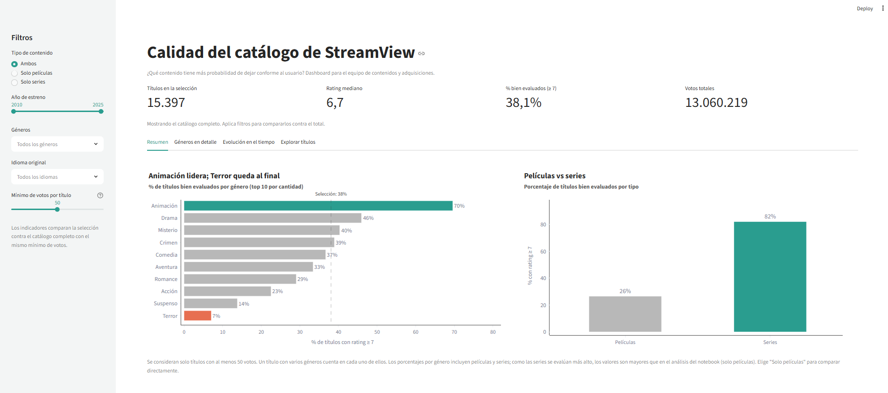

# StreamView Analytics — Visualización de Datos (ADY1104)

Proyecto grupal del ramo Visualización de Datos (Duoc UC). Trabajamos como equipo consultor para StreamView Analytics, una plataforma de streaming que quiere entender qué contenido de su catálogo es mejor evaluado para apoyar decisiones de adquisición y recomendación.

## Estructura del proyecto

```
proyecto_streamview/
├── data/          Datasets originales (películas y series, 2010-2025)
├── notebooks/     Notebook con la limpieza, el análisis exploratorio y el storytelling
├── dashboard/     Dashboard interactivo en Streamlit (app.py)
├── images/        Gráficos exportados desde el notebook
├── requirements.txt
└── README.md
```

## Cómo ejecutarlo

Se necesita Python 3.10 o superior. Todos los comandos se ejecutan desde la carpeta `proyecto_streamview/`.

1. Instalar las librerías (solo la primera vez):
   ```
   pip install -r requirements.txt
   ```
2. Abrir el dashboard:
   ```
   streamlit run dashboard/app.py
   ```
   Se abre en el navegador en `http://localhost:8501`. Para cerrarlo, `Ctrl + C` en la terminal.
3. Abrir el notebook: `jupyter notebook` y entrar a `notebooks/`, o abrirlo directamente en VS Code con la extensión de Jupyter.

No hay que cambiar rutas: el notebook y el dashboard buscan los CSV en `data/` automáticamente.

## Datos

- `netflix_movies_detailed_up_to_2025.csv`: 16.000 películas.
- `netflix_tv_shows_detailed_up_to_2025.csv`: 16.000 series.

Variables principales: título, tipo, géneros, año de estreno, idioma, rating (0 a 10), cantidad de votos y popularidad.

Limpieza aplicada: los ratings en 0 se tratan como faltantes (son títulos sin votos), se eliminan duplicados por `show_id`, se descartan columnas vacías o repetidas (`duration`, `vote_average`) y para el análisis de calidad solo se usan títulos con al menos 50 votos. El dashboard además deja fuera `budget`, `revenue` y `date_added`, que no se usan en ninguna de sus vistas.

## Contenido del dashboard



> **Por qué los porcentajes por género no calzan con el notebook.** El notebook analiza los géneros usando
> solo películas, mientras que el dashboard por defecto mezcla películas y series. Como las series se evalúan
> bastante más alto (82% con rating ≥ 7, contra 26% de las películas), los porcentajes por género del dashboard
> salen mayores: Animación aparece con ~70% en el dashboard y con 55% en el notebook. Eligiendo **Solo películas**
> en el filtro de tipo de contenido, los valores coinciden con los del análisis.

- Filtros por tipo, año, género, idioma y mínimo de votos.
- KPIs: títulos en la selección, rating mediano, % de títulos bien evaluados (rating ≥ 7) y votos totales, comparados contra el catálogo completo.
- Pestañas: Resumen, Géneros en detalle, Evolución en el tiempo y Explorar títulos (con buscador y ranking).
